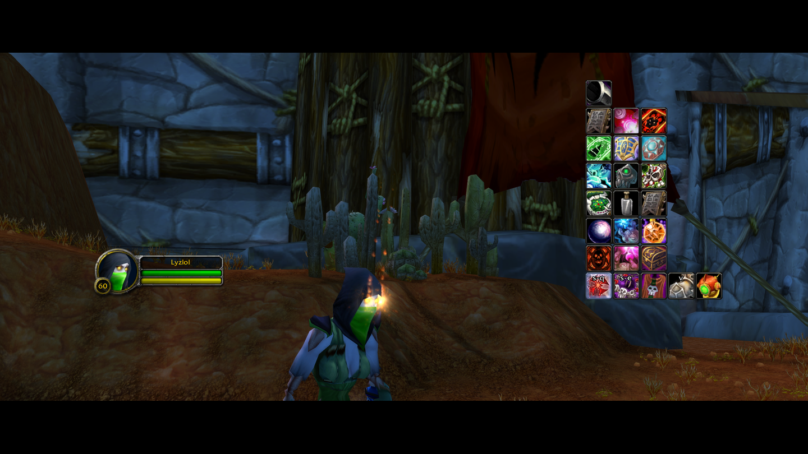
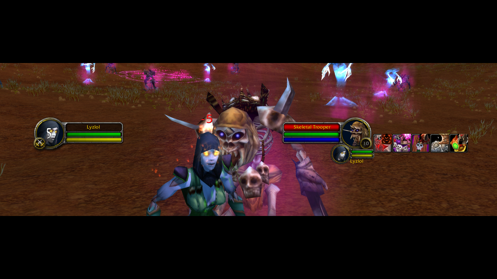
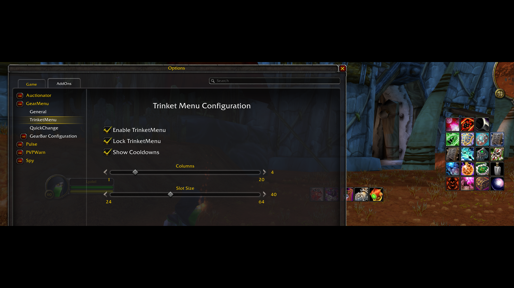
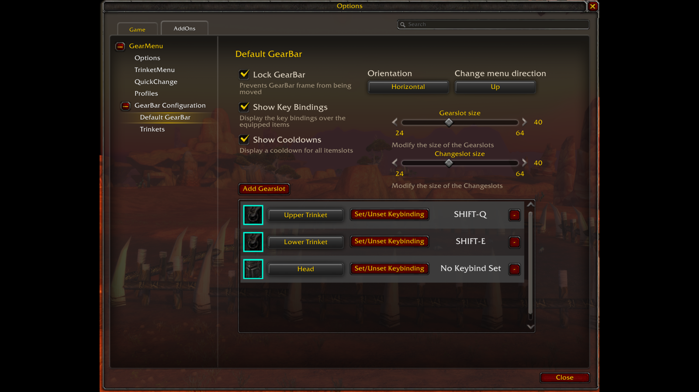
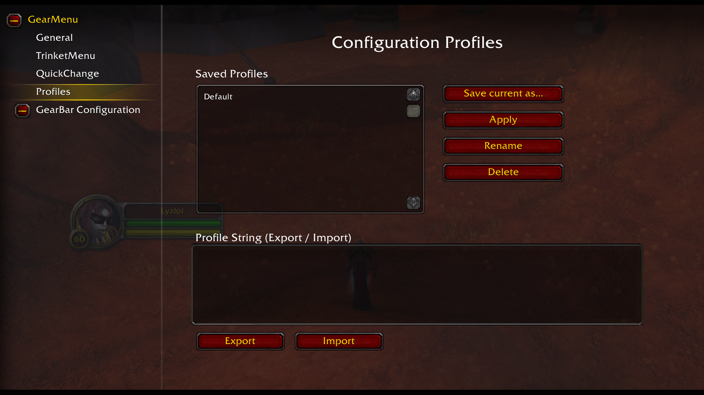

# Gallery Images

Static overview images for the GearMenu pages on
[wago.io](https://addons.wago.io/addons/gearmenu/gallery) and
[CurseForge](https://authors.curseforge.com/#/projects/345496/media). They give visitors a
quick visual summary of GearMenu's core features straight from the gallery/screenshot
strip — the full animated demos live in the project's main `README.md`, which has room
for more context. These rarely need updating; this folder is the source of truth when
they do.

**Editing them:** start from a fresh screenshot (any size) and normalize it to a 16:9
canvas under 2 MB. The current set was produced with ffmpeg (`raw/` is just a local
scratch folder for the source shots — it is not committed):

```
ffmpeg -i raw/<name>.png \
  -vf "scale=1600:900:force_original_aspect_ratio=decrease:flags=lanczos,pad=1600:900:(ow-iw)/2:(oh-ih)/2:color=black" \
  -frames:v 1 <name>.png
```

Black bars blend into the dark WoW scenes, and 16:9 keeps wide captures from rendering as
thin strips. Sizes stay under **2 MB** to clear CurseForge's 2 MB cap (wago allows up to
3072 KB). Drop the scale to `1440:810` for noisy full-scene shots that creep over 2 MB at
1600×900.

**Titles vs. descriptions:** CurseForge gallery images take both a **title** and a
**description**; wago only takes a description. The heading of each section below is used
as the CurseForge title, and the caption block is the description (and the wago caption).

Upload them by hand, one at a time, in the order below.

---

## 1. Item Switching



```
Swap the item in any equipment slot with a single click, in or out of combat - the core of GearMenu.
```

**File:** `gm_switch_items.png`

---

## 2. CombatQueue



```
Can't switch in combat? GearMenu queues the swap and equips it the instant you leave combat. Ideal for PvP.
```

**File:** `gm_combat_queue.png`

---

## 3. TrinketMenu



```
TrinketMenu keeps every trinket and its cooldown in view - enable it, lock it, and set the columns and size to taste.
```

**File:** `gm_trinket_menu.png`

---

## 4. Configuration



```
Configure each GearBar in depth: lock it, size the slots and change menu, pick which gear slots show, and bind a key to each slot.
```

**File:** `gm_configuration.png`

---

## 5. Profiles



```
Save your whole GearMenu setup as named profiles and switch between them - export and import as strings to share a setup with another character.
```

**File:** `gm_profile_configuration.png`
